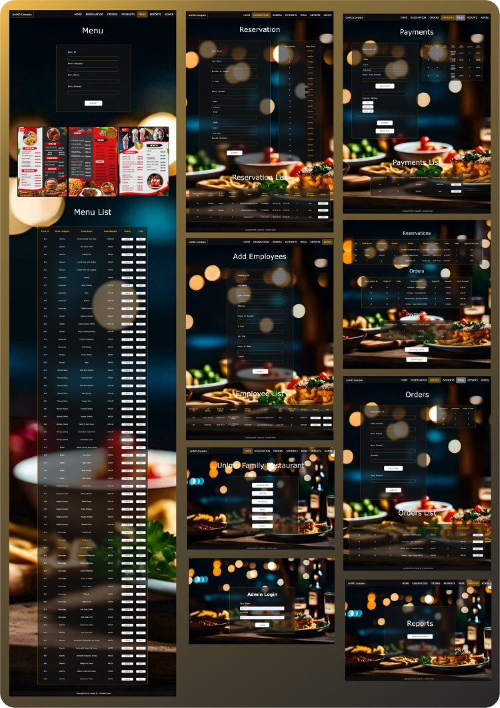

# Restaurant Management System

This project is a web-based restaurant management system developed using HTML, JavaScript, CSS, PHP, and MySQL (phpMyAdmin) using XAMPP. The system helps manage reservations, orders, payments, and employee data efficiently.

## Table of Contents

- [Features](#features)
- [Technologies Used](#technologies-used)
- [Database Structure](#database-structure)
- [Installation](#installation)
- [Usage](#usage)

## Features

- Manage table reservations
- Handle customer orders
- Process payments
- Manage menu items
- Employee management

## Technologies Used

- HTML
- CSS
- JavaScript
- PHP
- MySQL (phpMyAdmin)
- XAMPP

## Database Structure

### Databases and Tables

1. **adminemployeenew**
   - Table: `adminemployeenew`
     - Columns: `employee_id`, `full_name`, `date_of_birth`, `address`, `phone`, `email`, `job_title`, `hours_of_work`, `salary`

2. **menunew**
   - Table: `menunew`
     - Columns: `item_id`, `item_category`, `item_name`, `item_price`

3. **ordersnew**
   - Table: `ordersnew`
     - Columns: `reservation_id`, `order_id`, `item_ordered_name`, `quantity`, `amount`, `total_amount`

4. **paymentsnew**
   - Table: `paymentsnew`
     - Columns: `reservation_id`, `table_id`, `grandtotal_amount`, `payment_method`

5. **reservationnew**
   - Table: `reservationnew`
     - Columns: `first_name`, `last_name`, `numberofguests`, `email`, `phone`, `date`, `time`, `table`, `specialoccasion`

6. **tablesnew**
   - Table: `tablesnew`
     - Columns: `id`, `table_id`, `table`, `status`

## Installation

1. Clone the repository:
   - git clone https://github.com/J33WAKASUPUN/Restaurant Management 
     System.git
     
2. Install XAMPP from here if you don't have it installed.

3. Copy the project files to the htdocs directory in your XAMPP installation 
   directory.

4. Start Apache and MySQL from the XAMPP control panel.

5. Import the databases using phpMyAdmin:
    - Open http://localhost/phpmyadmin
      
    - Create new databases: adminemployeenew, menunew, ordersnew, 
      paymentsnew, reservationnew, tablesnew
      
    - Import the SQL files provided in the database directory of this 
      repository into their respective databases.
## Usage

1. Open your web browser and navigate to http://localhost/Login interface.php.

2. - Login user name and password - Jeewaka, 15611
   - Adimn login user name and password - ADMIN, 123456789

3. Use the system to manage reservations, orders, payments, and employee 
   data.

## Contact

   Jeewaka - supunprabodha789@gmail.com     

